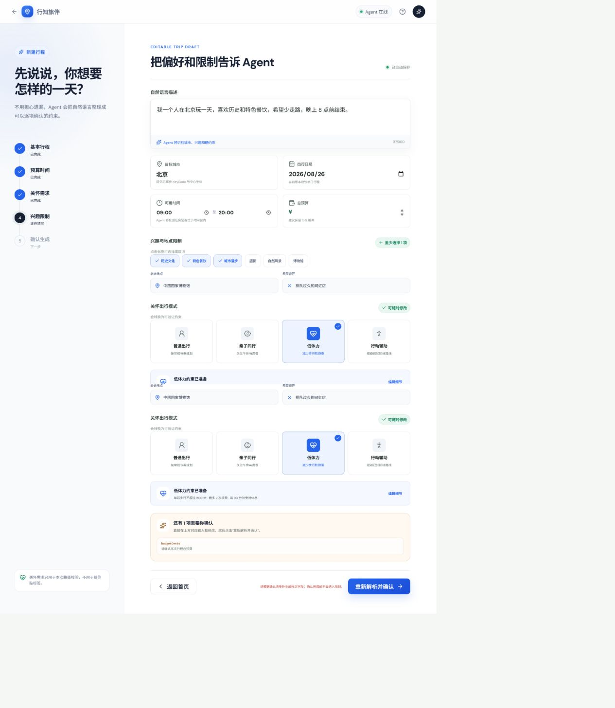
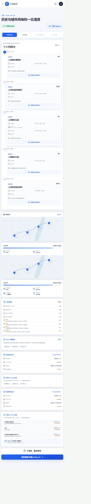
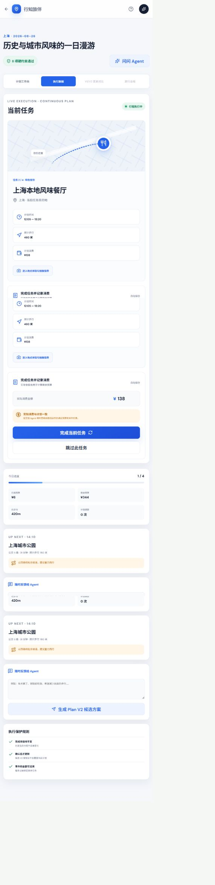

<div align="center">

# 行知旅伴

<p>面向国内城市、支持预算与关怀约束的单日旅行规划 Agent 原型。</p>


[项目简介](#项目简介) · [功能特性](#功能特性) · [快速开始](#快速开始) · [路线图](#路线图) · [项目文档](#项目文档)

</div>

<p align="center">
  
</p>

> 当前阶段：**Sprint 1 Beta** —— 单人单日核心闭环、真实起终点和真实地图已接通，费用变化可触发一次服务端重规划；公网发布仍在完善。

## 项目简介

行知旅伴面向国内城市的单日旅行规划场景。用户可以用自然语言输入城市、日期、预算、兴趣、地点和关怀需求，系统结合高德地点与路线事实，由服务端进行确定性约束校验，形成可执行的单日计划。

在执行过程中，系统记录任务状态和实际消费；实际消费变化可发起服务端重规划评估。服务端读取 CURRENT V1、可信规划事实与执行事件，并在未完成后缀仍可行时生成单个确定性候选 Plan V2，由用户决定接受或拒绝；无可行方案时继续保留 CURRENT V1。这里的边界很明确：**百炼大模型只把自然语言提取为候选字段，高德提供地点/路线事实，最终计划由行知旅伴服务端确定性校验**。未配置 `BAILIAN_API_KEY` 或百炼暂时不可用时，自然语言解析会明确降级为本地规则，不让模型输出直接绕过确认与约束。

## 功能特性

- 百炼 Qwen 自然语言字段提取、本地规则降级与逐项歧义确认
- 显式起终点输入与有限自然语言提取
- 普通、亲子、低体力、行动辅助四类关怀画像
- 高德城市、POI、路线距离、时长与来源事实
- 步行、换乘、休息、时间和预算的确定性校验
- 服务端签发并确认 Plan V1
- 开始、完成、跳过和实际消费执行事件
- 执行中迟到/疲劳的百炼草稿、10 秒固定表单降级与确定性临时约束（S2-T019/T020）
- 费用事件驱动的单候选 Plan V2、V1/V2 Diff、接受与拒绝
- 计划费用、实际费用、任务状态与版本历史基础总结

## 使用流程

```text
自然语言需求
    → 关怀画像确认
    → 高德地点/路线事实
    → 约束、路线与预算校验
    → 唯一 Plan V1
    → 执行与实际消费
    → 费用变化发起单次重规划评估（可行时进入 Plan V2 决策）
    → 旅行总结
```

## 产品演示

以下图片均来自仓库内已核验的验收证据，不含 API Key 或临时调试页。

<p align="center">
  
  
</p>

路线相关视图已接入高德地点、路线事实、道路底图、地点标记和真实 Polyline。上述截图用于展示已验证的需求确认、计划和执行工作台，不代表公网在线体验。

## 技术架构与技术栈

```text
React 19 + TypeScript + Vite 工作台
                │ HTTP
                ▼
FastAPI API
  ├─ 百炼 Qwen：自然语言候选字段提取（可选、失败时降级）
  ├─ 高德 Web 服务适配：城市、POI、路线事实
  ├─ 确定性规划与重规划：约束、预算、路线、版本
  ├─ PlanVersion 与执行事件服务
  └─ SQLite：Provider 缓存与业务状态
```

| 层次 | 技术 | 作用 |
| --- | --- | --- |
| 前端 | React 19、TypeScript、Vite | 响应式 Web 工作台、需求确认、计划与执行展示 |
| 后端 | Python 3.11+、FastAPI、Pydantic | API、领域校验、Plan V1/V2 与执行事件 |
| 自然语言模型 | 阿里云百炼 OpenAI 兼容接口 | 提取城市、日期、时间、预算与地点限制候选字段 |
| 外部事实 | 高德 Web 服务 | 城市、地点、路线距离、时长和来源事实 |
| 本地持久化 | SQLite | Provider 缓存、计划版本和执行事件 |
| 质量保障 | pytest、Node test、TypeScript、Vite | 后端回归、前端测试与生产构建 |

## 快速开始

### 环境要求

- Python 3.11 或更高版本
- Node 22
- 高德开放平台 Web 服务 Key（后端本地调用需要）
- 阿里云百炼 API Key（启用在线大模型识别时需要；不配置则使用本地规则）

### 1. 启动后端

在仓库根目录执行：

```powershell
python -m venv .venv
.venv\Scripts\Activate.ps1
python -m pip install -e ".[dev]"
Copy-Item .env.example .env
```

编辑根目录 `.env`，填写高德 Web 服务 Key。要演示在线大模型识别，还要填写一枚新建且未泄露的百炼 Key；其余配置可保留 `.env.example` 默认值：

```env
AMAP_WEB_SERVICE_KEY=你的Web服务Key
BAILIAN_API_KEY=你的百炼APIKey
BAILIAN_MODEL=qwen3.7-plus
```

启动后访问 `http://127.0.0.1:8000/api/v1/health`。返回
`"naturalLanguageParser":"BAILIAN_CONFIGURED"` 表示当前进程已按 Secret 装配百炼客户端；
若为 `DETERMINISTIC_RULES`，说明 Key 未配置。配置状态不等同于网络调用成功，
一次解析响应中的 `recognitionSource:"BAILIAN"` 才能证明该请求真实获得了模型结果；
`DEGRADED_RULES` 表示模型调用失败并已安全降级。

启动 API：

```powershell
uvicorn app.main:app --reload
```

### 2. 启动前端

另开一个终端，在仓库根目录执行：

```powershell
Set-Location frontend
Copy-Item .env.example .env
npm ci
npm run dev
```

`frontend/.env.example` 已提供本地 API 地址及工作流开关；复制后填写两项前端高德凭据：

```env
VITE_API_BASE_URL=http://127.0.0.1:8000
VITE_AMAP_JS_API_KEY=你的Web端（JS API）Key
VITE_AMAP_SECURITY_JS_CODE=你的安全密钥
VITE_USE_MOCK_API=false
VITE_USE_PLAN_VERSION_API=true
VITE_USE_WORKFLOW_API=true
```

前端通过后端调用高德 Web 服务：城市解析、同城 POI 检索和逐段路线规划均使用真实接口；路线总览另用高德 Web 端 JS API 显示道路底图、地点标记和路线轨迹。后端 `AMAP_WEB_SERVICE_KEY` 与前端 `VITE_AMAP_JS_API_KEY` 不是同一个 Key。根目录和前端的真实 `.env` 均受 Git 忽略，不能提交；只提交空值 `.env.example` 供同伴复制。

启动后可访问：

- Web 工作台：<http://localhost:5173>
- API：<http://127.0.0.1:8000>
- Swagger：<http://127.0.0.1:8000/docs>

### API Key 安全边界

- 高德 Web Service Key 只放在后端根目录 `.env`。
- 百炼 API Key 也只放在后端根目录 `.env` 或部署平台 Secret 中。
- 高德 Web端（JS API）Key 和安全密钥只放在本地 `frontend/.env`。
- 两类 Key 用途不同，均不得写入源码、截图或提交到 Git。
- `.env` 使用本地副本；测试默认使用模拟高德响应，不需要真实 Key。
- 仓库历史中出现过课堂调试凭据；旧凭据必须在平台撤销并换新，删除当前文件不能替代密钥轮换。

## 测试与质量

在仓库根目录完成后端测试：

```powershell
python -m pytest
```

再进入 `frontend`，运行前端测试、静态检查和生产构建：

```powershell
Set-Location frontend
npm test
npm run lint
npm run build
```

这些命令对应当前仓库的 `pyproject.toml` 与 `frontend/package.json`；测试结果应以最近一次本地验证输出或对应提交记录为准，不在首页硬编码易过时的通过数量。

## 路线图

勾选项表示已在稳定提交状态中验证；未完成项保持未勾选。

### Sprint 1：单人单日核心闭环

- [x] 自然语言需求与关怀画像确认
- [x] 百炼自然语言候选字段提取与确定性校验回填
- [x] 高德地点/路线事实接入
- [x] 服务端确定性 Plan V1 校验、签发与确认
- [x] 执行事件与实际消费记录
- [x] 单候选 Plan V2、V1/V2 Diff、接受与拒绝
- [x] 计划费用、实际费用和版本历史基础总结
- [x] 显式起终点输入与有限自然语言提取
- [x] 高德道路底图、地点标记与真实路线 Polyline
- [x] S1-T017 费用事件驱动的服务端重规划（单个确定性后缀候选、最多一次 V2）
- [x] T018 显式多候选校验、最小扰动排序与选中 V2 签发
- [ ] 服务端自主生成多个候选
- [x] 公网 HTTPS API 健康检查
- [ ] 公网 HTTPS 前端演示地址

### Sprint 2：多人和辅助体验

- [ ] 2—3 人公平推荐模式
- [ ] 一次性 GPS 到达辅助
- [ ] 任务照片
- [ ] 迟到与疲劳事件
- [ ] 旅行回忆页

### Sprint 3：质量与交付

- [ ] 故障降级与三城完整链、两城烟测
- [ ] 多日 Schema
- [ ] 自动化质量门禁
- [ ] 部署与答辩证据补齐

## 团队成员与 Sprint 1 主责

四名成员均参与开发、联调、测试和代码管理；模块主责只表示 Sprint 1 的首要推进责任，不构成固定技术岗位壁垒。PO、SM、QA 均为兼任职责。

| 成员 | Gitee 账号 | Sprint 1 主责模块 | Scrum 兼任职责 |
| --- | --- | --- | --- |
| 陈梓元 | `c_z_yy` | Agent 后端与主链编排 | PO |
| 林粲涵 | `rasz12345` | 规划、约束与路线风险 | QA |
| 张琪 | `fangfangxiao` | 高德 Provider、数据与 API | QA |
| 王敬博 | `wangjingbo` | 响应式 Web 与工作台 | SM |

## 项目文档

- [V2.3 项目规划书](doc/行知旅伴_旅行规划Agent_Scrum项目规划_V2.3.docx)
- [V2.3 产品待办列表](doc/行知旅伴_V2.3_产品待办列表_含负责人.xlsx)
- [V2.3 Sprint 1 待办列表](doc/行知旅伴_V2.3_Sprint1待办列表_含负责人.xlsx)
- [API 合同与当前接口](frontend/src/api/API.md)
- [部署说明](deploy/README.md)
- [Sprint 1 验收记录](docs/testing/2026-08-25-wang-jingbo-sprint1-acceptance.md)
- [S1-T017 事件驱动重规划验收](docs/testing/evidence/s1_t017/clean-slice-acceptance.md)
- [Sprint 1 评审记录](docs/reviews/2026-08-25-wang-jingbo-sprint1-review.md)
- [Sprint 1 追溯入口](docs/traceability/sprint1/wang_jingbo_sprint1.md)
- [AI 使用说明](doc/ai_usage.md)

## 已知限制、安全说明与明确不做事项

当前版本明确保留以下边界：

- 高德负责地点与路线事实，行知旅伴服务端负责确定性约束校验；不把高德描述成整套旅行计划生成器。
- 百炼只参与需求字段提取，不负责路线生成、预算裁决、关怀约束或 PlanVersion 状态变更；当前没有 LangGraph 运行时编排。
- 起终点只支持显式输入和有限自然语言表达，复杂自由表达仍需用户确认。
- Sprint 1 只支持 `EXPENSE_CHANGE` 发起一次服务端重规划评估；T018 能校验并排序调用方显式提交的多个候选，但 T017 当前只提供一个确定性候选，服务端自主多候选生成仍未完成。
- 2—3 人模式属于 Sprint 2，不把当前单人模式描述为多人公平推荐。
- 公网 HTTPS API 已可访问，但仓库配置中的 Web 地址当前没有可用前端服务，因此暂不提供在线体验按钮或远端 CI 徽章。

明确不做：持续 GPS、视频剪辑、全国无障碍保证、优惠券/跑腿，以及第三方批量抓取。

提交问题或复现本地行为时，请同时说明 Python/Node 版本、启动配置和是否使用模拟 Provider；不要上传 `.env`、真实 Key 或含敏感信息的截图。
