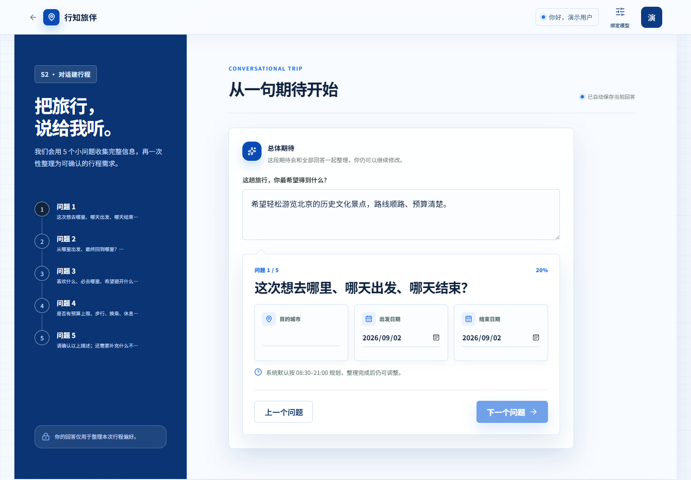
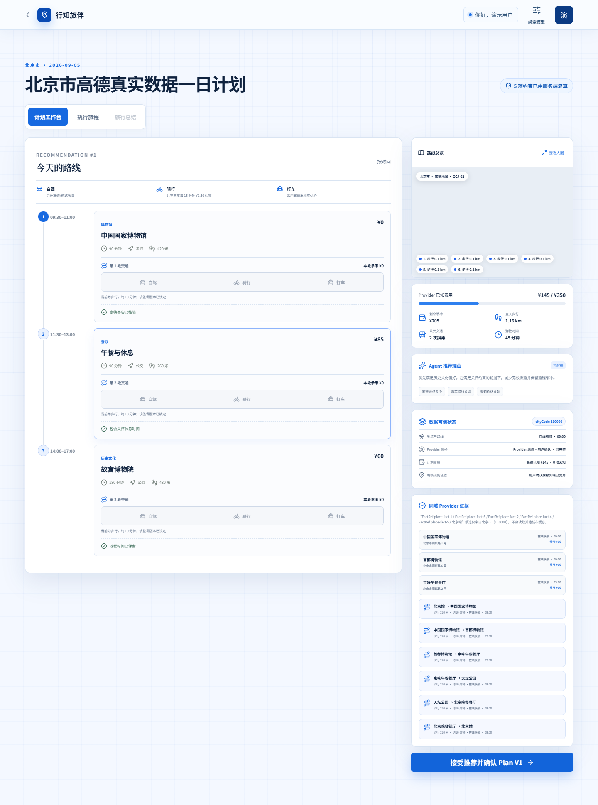
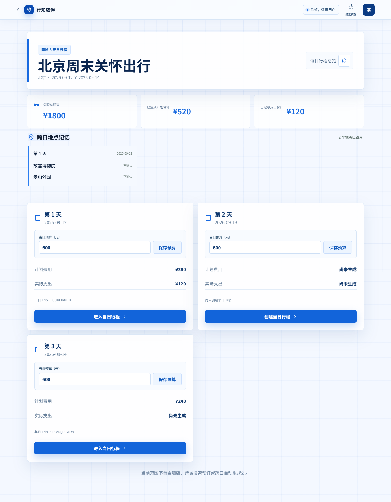

<div align="center">

# 行知旅伴

### 面向国内城市的受约束旅行规划 AI Agent

把自然语言需求、同行偏好、日期、预算与关怀限制组织为可确认的行程，结合高德地点与路线事实，由服务端完成约束校验后生成可执行的日计划。


[公网体验](https://imagine-1-31o2.onrender.com/) · [本地启动](#本地启动) · [部署说明](deploy/README.md)

[产品概览](#产品概览) · [适用场景](#适用场景) · [Agent 工作流](#agent-工作流) · [核心能力](#核心能力) · [产品演示](#产品演示) · [快速开始](#快速开始) · [项目结构](#项目结构) · [测试](#测试)

</div>

## 产品概览

行知旅伴不是只展示路线的网页。前端负责收集和呈现行程信息；服务端把需求、地点与路线事实、预算和关怀约束放进同一条受约束的规划流程，形成可确认、可执行、可记录的日计划。

对于多日出行，系统以父行程协调城市、日期、成员与每日预算，再让每一天进入独立的单日规划和执行流程。这样既能管理一趟多日旅行，也不会把尚未具备的“全局自动排程”写成已经完成的能力。

## 适用场景

| 场景 | 行知旅伴提供的流程 |
| --- | --- |
| 单人单日 | 用对话确认目的地、时间、预算、兴趣与关怀需求，生成并执行当日计划。 |
| 多人单日 | 成员分别确认偏好与限制，组织者处理冲突后进入共享的日计划流程。 |
| 单人多日 | 创建父行程并分配每日预算，按天进入单日规划。 |
| 多人多日 | 在父行程中协调成员、日期和每日预算，再分别规划和执行每一天。 |

## Agent 工作流

行知旅伴是一个**受约束的旅行规划 AI Agent**：AI 用于整理非权威的自然语言需求和辅助解释，外部地点与路线事实来自高德，最终计划必须通过服务端的确定性校验并由用户确认。

```
旅行目标与约束
    -> 需求整理与确认
    -> 高德地点、路线事实查询
    -> 时间、预算、步行、换乘、休息等约束校验
    -> 签发可确认的 Plan V1
    -> 执行记录与实际消费
    -> 可行时评估后续调整，并由用户决定是否接受 Plan V2
```

这条边界保证模型输出不会直接绕过用户确认、路线事实或硬约束。未配置大模型服务时，系统会使用本地规则完成可用的需求整理与确认流程。

## 核心能力

- 对话式收集旅行目标、城市、日期、起终点、预算、兴趣与关怀需求。
- 基于高德地点和路线事实核对距离、时长、来源信息与路线段。
- 在服务端统一校验预算、时间窗口、步行、换乘与休息等约束，生成可确认的 Plan V1。
- 支持开始、完成、跳过、实际消费等执行记录，并对后续行程进行调整评估。
- 支持多人偏好确认、冲突复核与共享行程的协作入口。
- 支持父行程管理多日日期框架、每日预算、跨日地点记忆与逐日进入单日行程。

## 产品演示

以下界面使用脱敏的本地演示数据采集，展示产品流程，不代表公网实例中的实时用户数据。

### 1. 从需求确认开始

<p align="center">
  
</p>

### 2. 核验路线并确认日计划

<p align="center">
  
</p>

### 3. 用父行程管理多日出行

<p align="center">
  
</p>

## 技术架构

```
React 19 + TypeScript + Vite
             |
             | HTTP
             v
FastAPI
  |- 自然语言需求整理与辅助解释（可选）
  |- 高德城市、地点、地理编码与路线事实
  |- 约束校验、计划版本与执行事件
  \-- SQLite 行程、账户与 Provider 缓存
```

| 层次 | 技术与职责 |
| --- | --- |
| 前端 | React、TypeScript、Vite；提供需求确认、路线工作台、执行记录和父行程界面。 |
| 后端 | Python、FastAPI、Pydantic；负责 API、约束校验、计划版本、协作与执行状态。 |
| AI 能力 | 阿里云百炼 OpenAI 兼容接口；用于需求整理和说明，不直接决定最终计划。 |
| 外部事实 | 高德 Web 服务；提供城市、地点、地理编码、距离与路线时长。 |
| 本地数据 | SQLite；保存行程、计划版本、协作状态、账户会话和 Provider 缓存。 |

## 快速开始

### 公网体验

- Web 工作台：[https://imagine-1-31o2.onrender.com/](https://imagine-1-31o2.onrender.com/)
- API 健康检查：[https://imagine-mp7v.onrender.com/api/v1/health](https://imagine-mp7v.onrender.com/api/v1/health)

公网服务是独立部署的演示快照，可能与当前仓库版本不同。请勿在演示环境输入真实 API Key、密码或其他敏感信息。

### 本地启动

**环境要求**

- Python 3.11+
- Node.js 22+
- 高德 Web 服务 Key：需要查询真实地点和路线时配置
- 高德 Web 端 JS API Key 与安全密钥：需要显示真实地图时配置
- 阿里云百炼 API Key：可选；未配置时使用本地规则

在仓库根目录打开第一个 PowerShell 终端：

```powershell
python -m venv .venv
.venv\Scripts\Activate.ps1
python -m pip install -e ".[dev]"
Copy-Item .env.example .env
uvicorn app.main:app --reload
```

在根目录 `.env` 中配置后端服务所需的 Key，再打开第二个 PowerShell 终端启动前端：

```powershell
Set-Location frontend
Copy-Item .env.example .env
npm ci
npm run dev
```

启动后访问：

- Web 工作台：<http://localhost:5173>
- API：<http://127.0.0.1:8000>
- OpenAPI：<http://127.0.0.1:8000/docs>

## 环境配置

| 配置项 | 用途 |
| --- | --- |
| `AMAP_WEB_SERVICE_KEY` | 后端查询城市、地点和路线事实。 |
| `BAILIAN_API_KEY` | 可选的自然语言需求整理能力；不配置时使用本地规则。 |
| `VITE_AMAP_JS_API_KEY` | 前端显示高德地图；与后端 Web Service Key 不是同一类 Key。 |
| `VITE_AMAP_SECURITY_JS_CODE` | 高德 Web 端 JS API 的安全密钥。 |
| `ACCOUNT_API_KEY_ENCRYPTION_KEY` | 部署环境中加密账户绑定 Key 的服务端密钥。 |

真实配置只放在本地 `.env` 或部署平台 Secret 中，不要提交到仓库、截图或日志。完整部署说明见 [deploy/README.md](deploy/README.md)。

## 项目结构

```
app/                 领域模型、应用服务与配置
backend/             FastAPI 路由、服务适配与后端测试
frontend/            React 工作台、页面、组件与前端测试
docs/                设计、测试与产品演示资源
deploy/              容器与公网部署说明
```

接口契约见 [frontend/src/api/API.md](frontend/src/api/API.md)。

## 测试

后端：

```powershell
python -m pytest
```

前端：

```powershell
Set-Location frontend
npm test
npm run lint
npm run build
```
